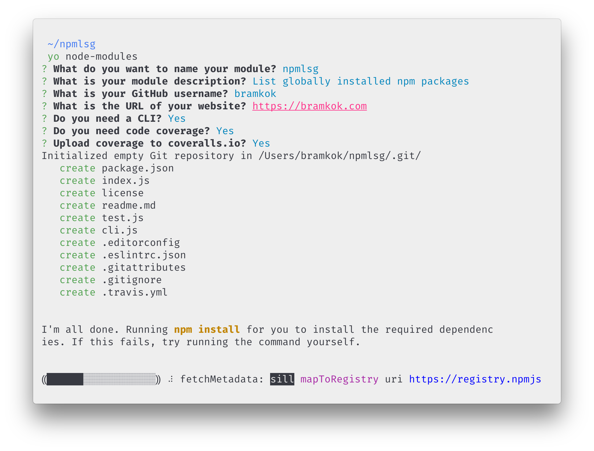

# generator-nm [](https://travis-ci.org/bramkok/generator-nm)

> Node module generator




## Install

```
$ npm install --global yo generator-nm
```


## Usage

With [yo](https://github.com/yeoman/yo):

```
$ yo nm
```

There are multiple command-line options available:

```
$ yo nm --help

  Usage:
    yo nm [options]

  Options:
    --help          # Print the generator's options and usage
    --skip-cache    # Do not remember prompt answers              Default: false
    --skip-install  # Do not automatically install dependencies   Default: false
    --org           # Publish to a GitHub organization account
    --cli           # Add a CLI
    --coverage      # Add code coverage with nyc
    --coveralls     # Upload coverage to coveralls.io (implies --coverage)
```

The `--org` option takes a string value (i.e. `--org=avajs`). All others are
boolean flags and can be negated with the `no` prefix (i.e. `--no-coveralls`).
You will be prompted for any options not passed on the command-line.

## Related

- [sindresorhus/nm-generator](https://github.com/sindresorhus/nm-generator)
Original repository

## License

MIT © [Bram Kok](https://bramkok.com)
